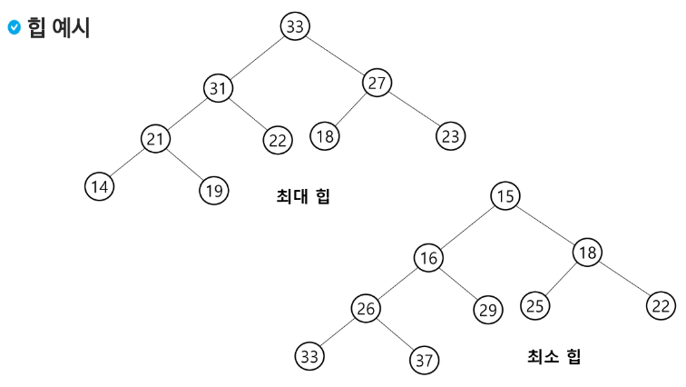
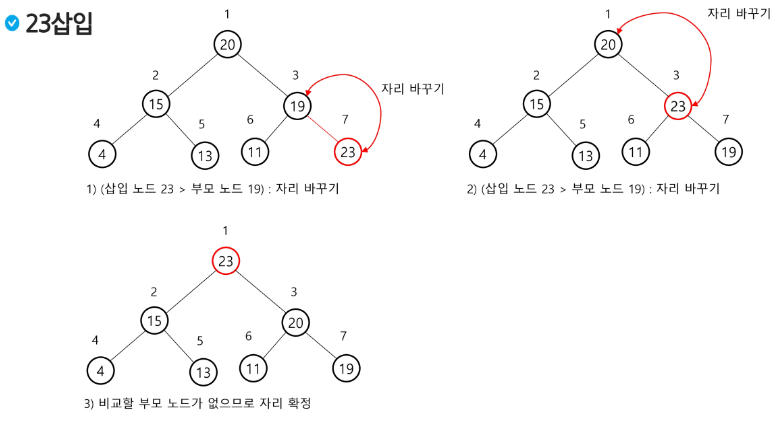
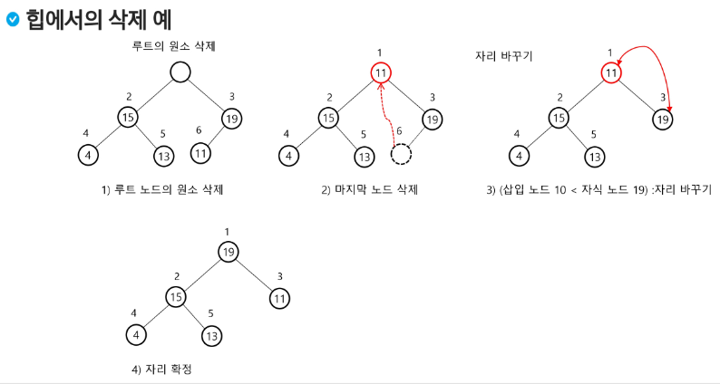

# 우선순위 큐

## 우선순위 큐란?
- 큐(Queue)는 먼저 들어온 데이터가 먼저 나가는 FIFO (First In First Out) 형식의 자료구조이다.
- 우선순위 큐 (Priority Queue)는 먼저 들어오는 데이터가 아니라, 우선순위가 높은 데이터가 먼저 나가는 형태의 자료구조이다.
- 우선순위 큐는 일반적으로 힙 (Heap)을 이용하여 구현한다.

### 힙이란?
- 힙 (Heap)은 우선순위 큐를 위해 고안된 가장 효율적인 형태의 완전 이진트리 자료구조이다.
- 완전이진트리에 있는 노드 중에서 키 값이 가장 큰 노드나 가장 작은 노드를 찾기 위해서 만든 자료구조이다.
- 노드 하나의 추가, 삭제가 시간 복잡도가 O(logN)이고, 최대, 최소값을 O(1)에 구할 수 있다.
- 완전 정렬보다 관리 비용이 적다.


### 힙의 특징
- 완전 이진트리 형태로 이루어져 있다.
- 부모노드와 서브트리 간 대소 관계가 성립된다. (반정렬 상태)
- 이진탐색트리와 달리 중복된 값이 허용된다.
- 배열을 통해 트리 형태를 쉽게 구현할 수 있다.
  - 부모나 자식 노드를 O(1)연산으로 쉽게 찾을 수 있다.
  - n 위치에 있는 노드의 자식은 2n과 2n+1위치한다.
  - 완전 이진 트리의 특성에 의해 추가, 삭제의 위치는 자료의 시작과 끝 인덱스로 쉽게 판단할 수 있다.

### 힙의 종류
- 최대 힙 (Max Heap)
  - 키 값이 가장 큰 노드를 찾기 위한 완전이진트리
  - 부모 노드의 키 값 > 자식 노드의 키 값
  - 루트 노드 : 키 값이 가장 큰 노드

- 최소 힙 (Min Heap)
  - 키 값이 가장 작은 노드를 찾기 위한 완전이진트리
  - 부모 노드의 키 값 < 자식 노드의 키 값
  - 루트 노드 : 키 값이 가장 작은 노드

  

  

- 힙에서는 루트 노드의 원소만을 삭제할 수 있다.
- 루트 노드의 원소를 삭제하여 반환한다.
- 힙의 종류에 따라 최대값 또는 최소값을 구할 수 있다.

  

## 힙 정렬 (Heap Sort)
- 힙 정렬은 힙 자료구조를 이용해 이진 탐색과 유사한 방법으로 수행된다.

### 정렬을 위한 2단계
- 하나의 값을 힙에 삽입한다. (반복)
- 힙에서 순차적 (오름차순)으로 값을 하나씩 제거한다.

### 힙 정렬의 시간 복잡도
- N개의 노드 삽입 연산 + N개의 노드 삭제 연산
- 삽입과 삭제 연산은 각각 O(NlogN)이다.
- 따라서, 전체 정렬은 O(NlogN)이다.


### 우선순위 큐 구현방법 비교

- 우선순위 큐를 힙이 아닌 배열이나 연결 리스트를 이용하여 구현할 수도 있다.
- 배열과 연결 리스트는 선형 구조의 자료구조이므로 삽입 또는 삭제 연산을 위한 시간복잡도가 O(n)이다.
- 반면 힙 트리는 완전이진트리 구조이므로 힙트리의 높이는 log(n+1)이며, 힙의 시간 복잡도는 O(log n)이다.


### 힙 정렬은 배열에 저장된 자료를 정렬하는데 유용하다.

### 오름차순 구현을 위해서는 Min Heap을 사용, 내림차순 구현을 위해서는 Max Heap을 사용하는 것이 편하다.

```python
# heap sort 주석있는 버전입니다. (Maxheap)
# max heap

arr=[6,4,1,2,6,4,8,43]
heap=[0]*30 # heap 자료구조로 저장할 배열 선언
hindex=1    # 1번 인덱스 부터 값 넣기

def insert(value):
    global hindex
    heap[hindex]=value              # 전달받은 값을 트리의 맨 뒤에 넣기
    now=hindex
    hindex+=1

    while 1:
        p=now//2                                # 부모 인덱스 구하기
        if p==0: break                          # 루트노드 (부모노드가 없다면 루트노드라는 뜻)
        if heap[p] >= heap[now]: break          # 부모값이 방금 들어온 값보다 크면 break
        heap[p],heap[now]=heap[now],heap[p]     # 부모가 방금 들어온 값보다 작으면 swap
        now=p                                   # 그다음 부모가 now가 되어 (부모의 부모랑 비교)
                                                # 트리의 위로 올라가면서 부모가 더 작으면 swap 계속 진행
def top():
    return heap[1]          # 우선순위가 가장높은 1번 인덱스의 값 출력

def pop():
    global hindex
    hindex-=1               
    heap[1]=heap[hindex]    # 트리의 가장 마지막에 있는 값을 트리의 루트로 올리기
    heap[hindex]=0          # 맨 마지막에 있던 값을 0으로 지우기

    now=1
    while 1:
        son=now*2       # 왼쪽자식
        rson=son+1      # 오른쪽자식
        
        # 오른쪽에 자식이 있고 그리고 오른쪽 자식이 왼쪽 자식보다 크다면
        # 오른쪽 자식을 부모랑 비교하는 비교대상으로 놓겠다.
        # 왼쪽 자식만 있거나 왼쪽자식이 오른쪽자식보다 크다면 비교대상은 왼쪽 자식이다.
        if rson<=hindex and heap[son] < heap[rson]: son=rson    
        
        # 왼쪽자식(or오른쪽자식)이 없거나 자식이 부모가 자식보다 크다면 break
        if son>hindex or heap[now]>heap[son]: break
        heap[now],heap[son]=heap[son],heap[now]
        now=son #트리의 밑으로 내려가면서 자식이 더 밑에있는 자식과 비교해서 더 큰지를 확인을 계속함

for i in range(len(arr)):   # heap 이진 트리 만들기
    insert(arr[i])          

for i in range(len(arr)):
    print(top(),end=' ')     # 우선순위가 가장 높은것은 출력하는 함수
    pop()            # 출력후 빼오기

```

## Heapq

```python

import heapq
# from queue import priorityQueue # -> heapq 보다 느리다

arr = [] # 함수 사용시 이 리스트를 인자로 넘긴다!!

heapq.heappush(arr,4)
heapq.heappush(arr,7)
heapq.heappush(arr,1)
heapq.heappush(arr,2)
heapq.heappush(arr,87)
heapq.heappush(arr,23)
print(arr)

# 기본 default 값은 min heap이다.

# print(heapq.heappop(arr)) -> 1
# print(heapq.heappop(arr)) -> 2
# print(heapq.heappop(arr)) -> 4
# print(heapq.heappop(arr)) -> 7
``` 

### for문, while문 사용하여 순서대로 출력할 수 있다.
```python
# for문 
for i in range(len(arr)):
    print(heapq.heappop(arr), end=' ')

# while문
while arr:
    node = heapq.heappop(arr)
    print(node,end=' ')
```

### heappush를 사용해서 heap 배열로 만드는 방법
```python
# 오름차순으로 출력하기 (우선순위 큐 사용)
# 1.
import heapq
arr = [234,345,567,456,21,45,89]
heap = []
for i in range(len(arr)): 
    heapq.heappush(heap,arr[i])

for i in range(len(arr)): # 출력
    print(heapq.heappop(heap),end=' ')
```

### heapify를 이용해서 한번에 heap의 자료형으로 바꾸기
```python
import heapq
arr = [234,345,567,456,21,45,89]
heapq.heapify(arr) 

for i in range(len(arr)):
    print(heapq.heappop(arr))
```

### Max Heap 사용한 우선순위 큐
### 방법 1
```python
# Max heap 으로 바꾸기

import heapq
arr = [234,345,567,456,21,45,89]
heap = []
for i in range(len(arr)):
    heapq.heappush(heap,-arr[i])

for i in range(len(arr)):
    # print(heapq.heappop(heap)*-1) # 이렇게 하면 내림차순으로 출력 가능
    print(-heapq.heappop(heap))

# 결과 567 456 345 234 89 45 21
```
### 방법 1.1
```python
# Max heap 으로 바꾸기

import heapq
arr = [234,345,567,456,21,45,89]
heap = []
for i in range(len(arr)):
    heapq.heappush(heap,(-arr[i],arr[i])) # 0번 기준으로 sort하고, 출력한다.

for i in range(len(arr)):
    print(heapq.heappop(heap)[1])

# 결과 567 456 345 234 89 45 21
```

### 방법 2 (추천!!)
```python
# Max heap 으로 바꾸기

import heapq
arr = [234,345,567,456,21,45,89]
heap = list(map(lambda x:-x,arr))
heapq.heapify(heap)

for i in range(len(arr)):
    print(-heapq.heappop(heap),end=' ')

# 결과 567 456 345 234 89 45 21
```

### 예시 문제

https://www.acmicpc.net/problem/1927

```python
# 백준 1927

import heapq
N = int(input())
card = []

for i in range(N):
    heapq.heappush(card,int(input()))

answer = 0
while len(card)>1:
    temp1 = heapq.heappop(card)
    temp2 = heapq.heappop(card)
    answer += (temp1 + temp2)
    heapq.heappush(card,temp1+temp2)
print(answer)
```